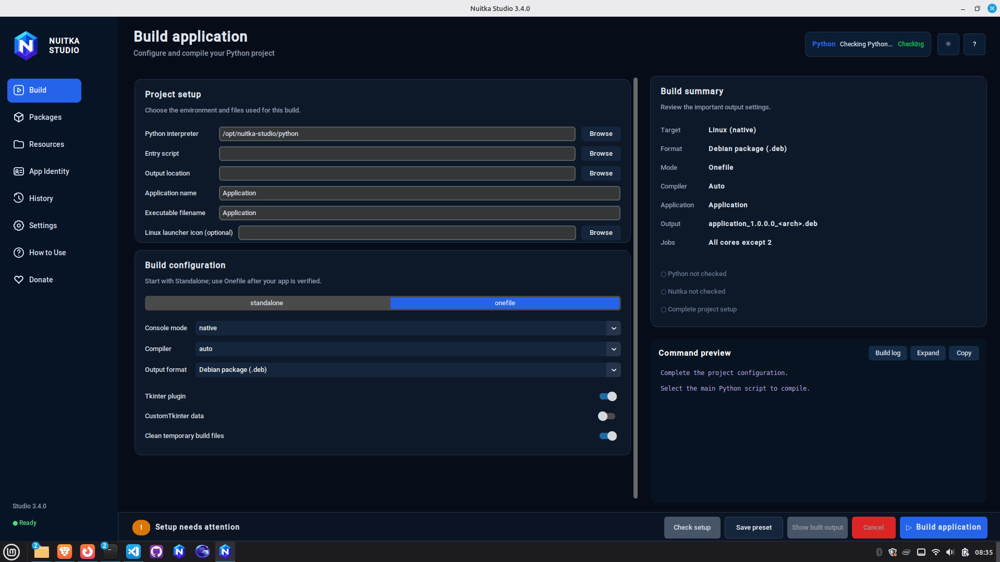
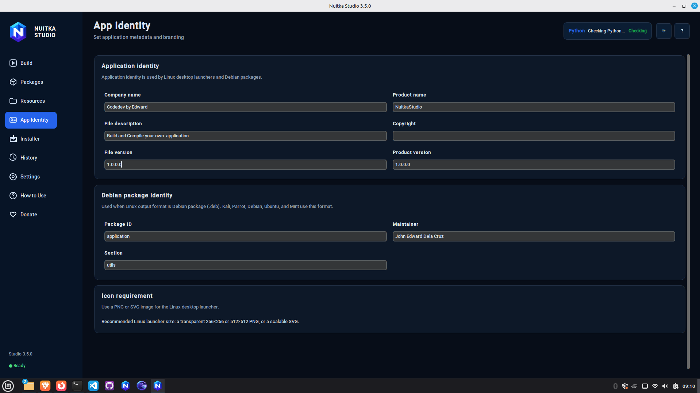

# Nuitka Studio

[](https://github.com/delacruzedward735-hash/Nuitka-Studio/actions/workflows/tests.yml)
[](LICENSE)
[](https://www.python.org/)
[](#platform-support)

**Nuitka Studio** is an open-source desktop interface for compiling and packaging Python applications with Nuitka. It helps developers create Windows executables, Linux applications, Windows setup installers, Debian packages, and native cross-platform builds through GitHub Actions without manually maintaining long compiler commands.

> **Independent project:** Nuitka Studio is a community-built frontend and is not affiliated with, sponsored by, or endorsed by the Nuitka project. Nuitka and related names belong to their respective owners.

## Highlights

- Windows `.exe` and native Linux ELF builds
- Standalone and one-file compilation modes
- Windows Setup generation through Inno Setup
- Debian `.deb` packaging for Debian-based Linux distributions
- GitHub Actions workflow generation for native Windows and Linux builds
- Package, hidden-import, resource, and application-metadata configuration
- Live build logs, phase-aware progress, safe cancellation, and build history
- Project switching that prevents stale entry scripts and resources from leaking between applications
- Fast startup through lazy page creation and responsive shutdown cleanup
- Optional Ko-fi and GCash support configuration

## Screenshots





## Platform support

| Host platform | Native outputs |
|---|---|
| Windows 10/11 | Windows `.exe`, standalone folder, one-file executable, Inno Setup installer |
| Debian-based Linux | Linux ELF, standalone folder, one-file executable, `.deb` package |
| Either platform | GitHub Actions workflow for native Windows and Linux artifacts |

Nuitka Studio does not rename or emulate binaries from another operating system. Cross Build uses native GitHub-hosted runners for each target.

## Requirements

### Windows

- Python 3.12 recommended
- Microsoft Visual C++ Build Tools, or a compiler supported by Nuitka
- Inno Setup 6 for Windows Setup installers

### Linux

- Python 3.10 or newer
- Tk and venv support
- GCC/build-essential or Clang
- `patchelf` and `ccache` recommended
- `dpkg-deb` for Debian package output

## Quick start

### Linux

```bash
git clone https://github.com/delacruzedward735-hash/Nuitka-Studio.git
cd Nuitka-Studio
chmod +x install_and_run.sh start.sh build_gui_linux.sh build_gui_deb.sh
./install_and_run.sh
```

Later launches:

```bash
./start.sh
```

### Windows

```powershell
git clone https://github.com/delacruzedward735-hash/Nuitka-Studio.git
cd Nuitka-Studio
.\install_and_run.bat
```

Later launches:

```powershell
.\start.bat
```

## Basic workflow

1. Select the Python interpreter from the project being compiled.
2. Select the project's real entry script, such as `main.py` or `app.py`.
3. Choose an output folder and application name.
4. Add required packages and runtime resources.
5. Configure metadata under **App Identity**.
6. Build in **Standalone** mode first and test the result.
7. Use **Onefile**, Windows Setup, or Debian packaging only after the standalone build works.
8. Use **Cross Build** to generate native Windows and Linux artifacts through GitHub Actions.

## Development setup

```bash
python -m venv .venv
source .venv/bin/activate        # Linux/macOS
# .venv\Scripts\activate       # Windows
python -m pip install --upgrade pip
python -m pip install -r requirements.txt
python -m unittest discover -s tests -v
python run.py
```

Run the repository checks:

```bash
python scripts/open_source_check.py
```

See [CONTRIBUTING.md](CONTRIBUTING.md) and [docs/DEVELOPMENT.md](docs/DEVELOPMENT.md) before submitting changes. Build and packaging guides are available under [`docs/guides/`](docs/guides/). Follow [docs/GITHUB_PUBLISHING.md](docs/GITHUB_PUBLISHING.md) when publishing the repository.

## Repository structure

```text
nuitka_gui/                 Application source
assets/                     Icons and public runtime configuration
tests/                      Automated regression tests
.github/                    CI, contribution templates, and dependency updates
docs/                       Architecture, development, and release documentation
scripts/                    Repository validation tools
run.py                      Main source entry point
bootstrap.py                Environment bootstrap helper
```

## Security and privacy

Do not include passwords, API keys, access tokens, OTPs, MPINs, private certificates, or personal identity documents in issues, logs, screenshots, or donation configuration. Follow [SECURITY.md](SECURITY.md) for responsible vulnerability reporting.

## Contributing

Bug reports, documentation improvements, platform testing, and focused pull requests are welcome. Read [CONTRIBUTING.md](CONTRIBUTING.md) and follow the [Code of Conduct](CODE_OF_CONDUCT.md).

## License

Nuitka Studio source code and documentation are released under the [MIT License](LICENSE). Third-party tools and Python packages keep their own licenses; see [THIRD_PARTY_NOTICES.md](THIRD_PARTY_NOTICES.md).

The MIT License does not grant permission to imply that a modified release is official or endorsed. See [BRANDING.md](BRANDING.md) for the project-name and logo policy.

## Maintainer

**John Edward Dela Cruz**  
GitHub: [@delacruzedward735-hash](https://github.com/delacruzedward735-hash)  
Portfolio: [myportfoliohub.online](https://myportfoliohub.online)

## Release status

Version **3.9.3** is the first open-source-ready release. It includes community files, CI configuration, dependency update automation, security guidance, licensing notices, and repository validation checks.
